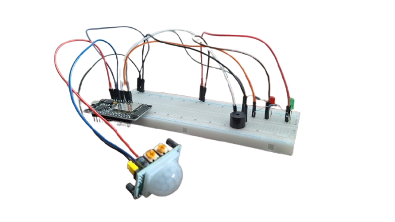

# 🔐 IoT Alarm — ESP32 + Node-RED with RSA over MQTT

A small but complete IoT intrusion-alarm system built for the **IoT course (IPB, 2025/2026)**.

An **ESP32** acts as the alarm node: it watches a **PIR motion sensor** and, when armed, latches a buzzer + red LED until it is disarmed with the correct PIN. A **Node-RED** dashboard provides a virtual keypad (a Vue single-file component) to arm/disarm the system and change the PIN remotely.

Because the keypad sends a **PIN over a public MQTT broker**, every command is **end-to-end encrypted with RSA**: the ESP32 generates its own keypair on boot, publishes the *public* key over MQTT, and Node-RED encrypts each command so that **only the ESP32 can read it**.

---

## ✨ Features

- **Motion detection** with a PIR sensor; alarm **latches ON** until a valid PIN is entered.
- **Non-blocking buzzer/LED blink** — MQTT keeps being serviced while the alarm sounds, so the disarm command is never missed.
- **RSA-2048 (OAEP / SHA-1) encryption** of every command, end-to-end from Node-RED to the ESP32.
- **Remote PIN change** with old-PIN verification.
- **Persistent PIN** stored in the ESP32's NVS flash (survives reboots).
- **Request/response correlation** via a per-command UUID, so the dashboard knows which reply is its own.
- **Virtual keypad UI** with a retro green-on-black display, built as a Node-RED Dashboard 2.0 Vue template.

---

## 🧩 Architecture

```
┌──────────────────┐        encrypted command         ┌──────────────────┐
│   Node-RED        │ ───────────────────────────────▶ │      ESP32        │
│  (Vue keypad UI)  │   .../Notifications/Personal/     │  (alarm node)     │
│                   │                                   │                   │
│  rsa-encrypt ◀────┼─── public key (every 5 s) ────────┤  PIR · Buzzer     │
│                   │   .../Crypto/PublicKey/           │  Green/Red LEDs   │
│                   │ ◀──── response (cleartext) ───────┤                   │
└──────────────────┘   .../Notifications/Personal/{uuid}└──────────────────┘
                                                        broker.mqtt-dashboard.com
```

1. On boot the ESP32 generates an **RSA-2048 keypair** and republishes its **public key** every 5 s on `…/Crypto/PublicKey/`.
2. Node-RED's `rsa-encrypt` node uses that public key to encrypt the JSON command (login / password change).
3. The encrypted blob is published to the **static request topic** `…/Notifications/Personal/`.
4. The ESP32 decrypts it with its private key, acts on it, and publishes a cleartext reply to the **dynamic response topic** `…/Notifications/Personal/{uuid}`.
5. The dashboard matches the `uuid` to the command it sent and updates the UI.

> **Why a dynamic response topic?** Each command carries a freshly generated UUID. Replies go to `…/Personal/{uuid}`, so concurrent clients never see each other's responses.

---

## 📡 MQTT Topics

| Topic                                            | Direction        | Payload                                |
| ------------------------------------------------ | ---------------- | -------------------------------------- |
| `IPB/IoT/AlarmProject/Crypto/PublicKey/`         | ESP32 → broker   | ESP32 RSA public key (PEM)             |
| `IPB/IoT/AlarmProject/Notifications/Personal/`   | Node-RED → ESP32 | **RSA-encrypted** command (JSON)       |
| `IPB/IoT/AlarmProject/Notifications/Personal/{uuid}` | ESP32 → Node-RED | Cleartext response (JSON)           |

**Broker:** `broker.mqtt-dashboard.com:1883` (public HiveMQ test broker).

---

## 🔁 Command Protocol

All commands are JSON, encrypted before publishing. Each carries a `uuid` for correlation.

**Arm / disarm** (a single valid PIN toggles the armed state):
```json
{ "action": "login", "pin": "123456", "uuid": "…" }
```
Response:
```json
{ "action": "login_response", "uuid": "…", "success": true, "armed": true }
```

**Change PIN** (requires the current PIN; new PIN must be 1–6 digits):
```json
{ "action": "update_password", "old_password": "123456", "new_password": "4242", "uuid": "…" }
```
Response:
```json
{ "action": "update_password_response", "uuid": "…", "success": true }
```

---

## 🛠️ Hardware

<p align="center">
  
</p>

| Component       | ESP32 Pin |
| --------------- | --------- |
| Buzzer          | GPIO 14   |
| PIR sensor      | GPIO 13   |
| Green LED (idle/disarmed) | GPIO 26 |
| Red LED (armed/alarm)     | GPIO 25 |

**LED behaviour**

- 🟢 **Green solid** — disarmed / idle.
- 🔴 **Red solid** — armed, no motion.
- 🔴 **Red blinking + buzzer** — alarm triggered (latched until disarmed).

---

## 🚀 Getting Started

### 1. Flash the ESP32 (`project.ino`)

Install the required Arduino libraries:

- `PubSubClient`
- `ArduinoJson`
- *(mbedTLS and `Preferences` ship with the ESP32 Arduino core)*

Then set your Wi-Fi credentials at the top of `project.ino`:

```cpp
const char* ssid     = "YOUR_WIFI_SSID";
const char* password = "YOUR_WIFI_PASSWORD";
```

Select your ESP32 board, compile and upload. Open the Serial Monitor at **115200 baud** to watch it generate the RSA keypair and connect.

> Default PIN is **`123456`** (stored in NVS; changeable from the keypad).

### 2. Import the Node-RED flow (`flows.json`)

Requires Node-RED with **[`@flowfuse/node-red-dashboard`](https://dashboard.flowfuse.com/) (Dashboard 2.0)** and an RSA-encrypt node (`node-red-contrib-rsa` / sense-rsa).

1. Open Node-RED → **Menu → Import** → paste `flows.json`.
2. Deploy.
3. Open the dashboard (e.g. `http://localhost:1880/dashboard`).

The `index.html` file is the standalone source of the keypad Vue component embedded in the flow's `ui-template` node — handy for editing the UI in your editor.

### 3. Use the keypad

- Type your **PIN → OK** to **arm/disarm**.
- Type **`000000` → OK** to enter the **change-PIN** flow (current PIN → new PIN → confirm).

---

## 🔒 Security Notes

- RSA padding is **OAEP with SHA-1** on both ends — the ESP32 sets `MBEDTLS_RSA_PKCS_V21 / MBEDTLS_MD_SHA1` to match the Node-RED encrypt node. A mismatch yields `MBEDTLS_ERR_RSA_INVALID_PADDING (-0x4100)`.
- The **public broker is untrusted by design** — only the ESP32 holds the private key, so commands can't be read in transit. Responses, however, are cleartext.
- **Never commit real Wi-Fi credentials.** The placeholders in `project.ino` are intentional.

---

## 📂 Repository Layout

| File                    | Description                                              |
| ----------------------- | ------------------------------------------------------- |
| `project.ino`           | ESP32 firmware (Wi-Fi, MQTT, RSA, alarm logic)          |
| `flows.json`            | Node-RED flow (dashboard, RSA encryption, MQTT routing) |
| `index.html`            | Vue keypad component (source of the `ui-template`)      |
| `Report IoT Project.pdf`| Full project report                                     |

---

## 📜 License

Released under the [MIT License](LICENSE).
